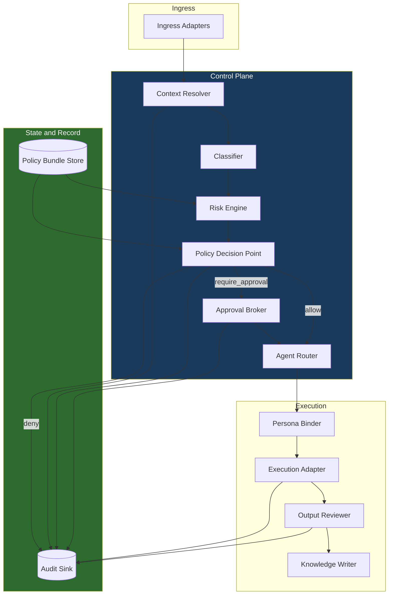
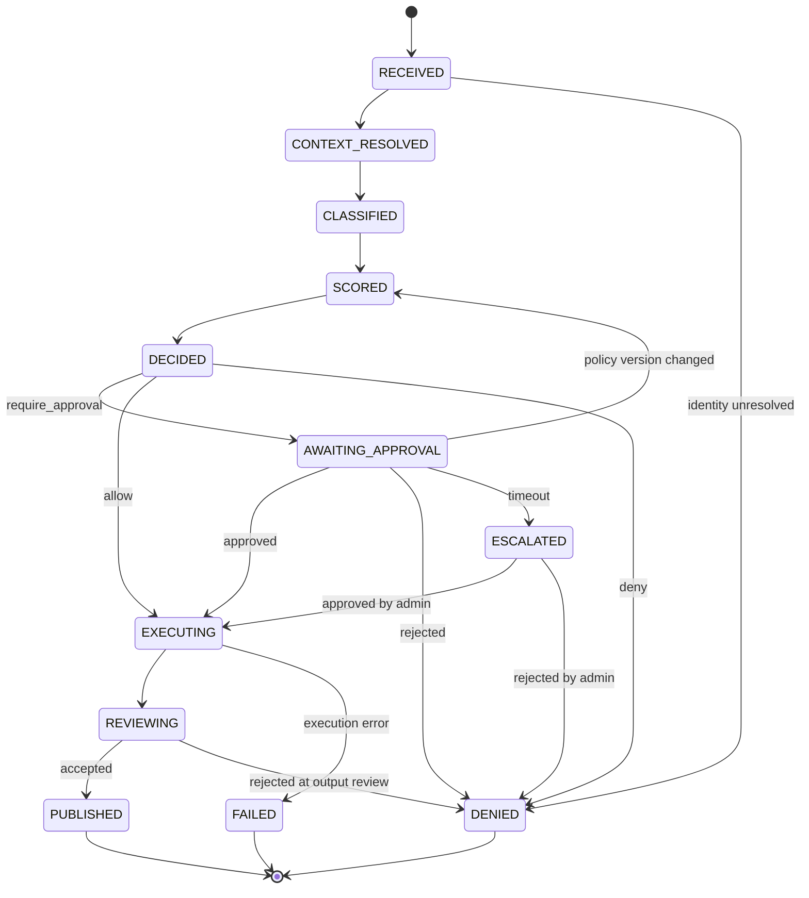

# PAIOS System Design

This document specifies the system design for the PAIOS control plane. It translates the governance concepts described in `docs/` into component boundaries, evaluation semantics, data structures, and interface contracts.

The existing documentation describes *what* the framework governs. This document describes *how* the control plane is structured to enforce it.

## 1. Scope

### In scope

- Decomposition of the control plane into components with defined responsibilities
- The request lifecycle as an explicit state machine
- Policy evaluation semantics, including ordering and conflict resolution
- Risk scoring as a deterministic function
- The persisted data model and its retention characteristics
- Interface contracts between the control plane and its adapters
- Failure modes and degradation behavior

### Out of scope

- Model prompt design and agent instruction content
- Tenant-specific policy content (the framework defines the schema, not the rules)
- User interface design for approval surfaces beyond the payload contract
- Deployment topology and capacity planning

### Status

This is a reference design. It describes an intended structure, not a deployed system. Component names in this document are logical roles; they do not assert the existence of shipped services.

## 2. Design principles

**Policy is data, not code.** Governance rules are expressed as versioned policy bundles evaluated at runtime. Changing what is governed must not require changing the control plane.

**Deterministic decisions precede non-deterministic execution.** Classification may use a model, but the gate that decides *allow / review / deny* is a pure function of the classification result, the resolved context, and the pinned policy bundle. The same inputs must always produce the same decision.

**Fail closed.** Any component that cannot complete its work escalates the request to human review rather than allowing execution to proceed ungoverned. Absence of a signal is never treated as absence of risk.

**Audit before execute.** An execution record is committed to the audit sink before the model or agent is invoked, not after. A failure to write audit is a failure to execute.

**Model-agnostic execution.** The control plane addresses agents by logical role. Which model backs a role is a binding concern, resolved at execution time and recorded in the audit trail.

**Every decision is reconstructible.** Given a request ID, it must be possible to reproduce the decision that was made, the policy version that produced it, and the identity that approved it.

## 3. Component decomposition

### 3.1 Ingress Adapters

Normalize inbound requests from Teams, Copilot Studio, HTTP, and Power Automate into a single internal request envelope. Adapters carry no governance logic. Their sole responsibility is translation and the attachment of a channel identifier, which becomes an input to policy evaluation.

An adapter must not accept a caller-supplied risk level, classification, or agent assignment. Those fields are control-plane outputs; accepting them from the edge would let a caller govern their own request.

### 3.2 Context Resolver

Resolves the requesting identity against the directory and produces the context record: principal, group memberships, role, business area, and channel. Establishes whether the principal is entitled to submit requests at all.

Failure to resolve identity is terminal — the request is denied and logged. This is the only component whose failure produces a denial rather than an escalation, because an unresolved principal cannot be presented to an approver for review.

### 3.3 Classifier

Assigns a request type and a set of sensitivity signals. Runs in two stages:

1. **Deterministic pass.** Pattern and keyword rules from the policy bundle. Anything matched here is authoritative and is not revisited.
2. **Model-assisted pass.** Applied only to requests the deterministic pass left unclassified. Produces a proposed type with a confidence value.

The model-assisted pass may only *raise* sensitivity, never lower it. A deterministic rule that marks a request as compliance-relevant cannot be overridden by a model that judges it routine. Confidence below the bundle-defined threshold classifies the request as `unclassified`, which the risk engine treats as sensitive.

### 3.4 Risk Engine

Maps the classification result and context to exactly one risk level using the deterministic table in §6. It contains no model calls and no I/O beyond reading the pinned policy bundle.

### 3.5 Policy Decision Point (PDP)

Evaluates the policy bundle against `(context, classification, risk)` and emits a decision: `allow`, `require_approval`, or `deny`, together with the obligations attached to that decision — required reviewer role, permitted data sources, prohibited actions, and output target.

The PDP is the single place where governance outcomes are determined. No downstream component may widen a decision; components may only enforce it.

### 3.6 Approval Broker

Owns requests in `AWAITING_APPROVAL`. Delivers the approval payload to the reviewer role named in the decision obligations, tracks the response, and enforces the timeout defined by the bundle.

Approval is bound to the decision that produced it. If the pinned policy bundle version changes while a request is awaiting approval, the pending approval is invalidated and the request re-enters evaluation — an approver's consent applies to the rules they saw, not to rules introduced afterward.

Timeout escalates rather than approves or denies. An unanswered approval is an operational failure, and silently resolving it in either direction discards accountability.

### 3.7 Agent Router and Persona Binder

The router selects the logical agent role from the decision. The binder resolves that role to a concrete model endpoint and applies the persona constraints — permitted data sources, prohibited actions, output constraints — carried in the decision obligations.

The binder is the enforcement point for agent policy. Constraints are applied as execution-time restrictions on the adapter, not as instructions in a prompt, because prompt-level constraints are advisory and the governance model requires them to be binding.

### 3.8 Execution Adapter

Invokes the bound model or workflow. Records the model identifier and version actually used, so that an audit record names the system that produced the output rather than the role that was requested.

### 3.9 Output Reviewer

Applies post-execution checks defined by the decision obligations: sensitivity scanning of the produced output, destination validation, and any required human review of the result. A request whose *input* was low risk may still produce an output that requires review — the reviewer exists so that risk assessed at intake is re-checked against what was actually generated.

### 3.10 Knowledge Writer

Persists approved output to the target named in the decision obligations and returns the resulting location for the audit record. Writing to any destination other than the one carried in the decision is a policy violation, not a routing choice.

### 3.11 Audit Sink

Append-only. Records are written at every state transition. The sink accepts no updates and no deletes; corrections are new records that reference the record being corrected.

## 4. Request lifecycle

Every transition writes an audit record. `DENIED`, `PUBLISHED`, and `FAILED` are terminal; a superseded request is a new request that references its predecessor.

Transitions are the only path between states. A component that cannot complete its stage transitions the request to `AWAITING_APPROVAL` with an obligation naming the failed stage — this is the concrete form of the fail-closed principle.

## 5. Policy model

### 5.1 Bundle structure

A policy bundle is a versioned, immutable document containing classification rules, risk mappings, decision rules, agent policies, and approval configuration. Bundles are addressed by version. A request pins the bundle version at `CONTEXT_RESOLVED` and evaluates against that version for its entire lifetime.

The schema is defined in `policies/schemas/policy-bundle.schema.json`.

### 5.2 Rule structure

Each decision rule declares a `match` block over context, classification, and risk fields, and an `effect` of `allow`, `require_approval`, or `deny`, with optional `obligations`.

### 5.3 Evaluation order and conflict resolution

1. All rules whose `match` block is satisfied are collected. Rule order in the document is not significant.
2. If any matched rule has effect `deny`, the decision is `deny`. **Deny overrides.**
3. Otherwise, if any matched rule has effect `require_approval`, the decision is `require_approval`, and the most restrictive approver role among those rules is required.
4. Otherwise, if at least one rule matched with effect `allow`, the decision is `allow`.
5. If no rule matched, the decision is `require_approval`. **Absence of a permitting rule is not permission.**

Obligations from all matched rules are merged as an intersection for permissions — permitted data sources, permitted actions — and a union for restrictions. A rule can only narrow what another rule permits.

### 5.4 Versioning

Bundles are immutable once published. A governance change produces a new version; it never edits an existing one. This is what makes a historical decision reconstructible, since the bundle that produced it still exists in the form it had at decision time.

Changes to a bundle are themselves requests of type `governance_change`, which the classification model routes to a human approval gate.

## 6. Risk scoring

The risk level is the maximum of the levels triggered by the following conditions. Conditions are evaluated against the classification result and context; the highest triggered level wins.

| Level | Triggering conditions | Baseline decision |
|-------|----------------------|-------------------|
| `low` | Routine request type, no sensitivity signals, internal channel | `allow` |
| `standard` | Normal operational request, no sensitivity signals | `allow` with logging |
| `sensitive` | Personal or client data signal, external communication, `unclassified` result, classifier below confidence threshold, or any degraded component | `require_approval` |
| `compliance` | Regulatory, legal, or records-retention signal | `require_approval`, reviewer role restricted, documentation obligation attached |
| `security` | Access modification, system change, credential access, or log access | `require_approval` by an administrator role |

The baseline decision is the starting point, not the outcome. Policy rules in the bundle may raise it. They may not lower it — a bundle rule cannot grant `allow` to a request scored `security`.

## 7. Data model

| Entity | Key fields | Lifetime |
|--------|-----------|----------|
| `Request` | `request_id`, `principal`, `channel`, `submitted_at`, `state`, `policy_bundle_version`, `supersedes` | Retained per records policy |
| `ClassificationRecord` | `request_id`, `request_type`, `sensitivity_signals[]`, `method` (deterministic / model), `confidence` | Same as request |
| `Decision` | `request_id`, `effect`, `risk_level`, `matched_rule_ids[]`, `obligations`, `bundle_version` | Same as request |
| `Approval` | `request_id`, `decision_id`, `approver`, `outcome`, `responded_at`, `bundle_version` | Same as request |
| `Execution` | `request_id`, `agent_role`, `model_identifier`, `started_at`, `completed_at`, `outcome` | Same as request |
| `AuditRecord` | `record_id`, `request_id`, `from_state`, `to_state`, `actor`, `timestamp`, `corrects` | Append-only, retained independently |
| `AgentPolicy` | `agent_name`, `owner`, `allowed_users[]`, `allowed_data_sources[]`, `restricted_actions[]`, `review_cycle` | Versioned with bundle |

`Decision` carries `matched_rule_ids` rather than a rendered explanation. Given the rule IDs and the immutable bundle version, the reasoning is recoverable in full; a prose summary generated at decision time would not be.

Audit records outlive requests. Deleting a request under a records policy must not delete the record that it occurred.

## 8. Interfaces

The control plane exposes a narrow surface. Adapters translate into it; they do not bypass it.

| Operation | Purpose | Notes |
|-----------|---------|-------|
| `POST /requests` | Submit a request | Accepts envelope and context hints only. Classification, risk, and routing fields are rejected if present. |
| `GET /requests/{id}` | Retrieve state and decision | Returns current state, decision effect, and obligations. |
| `POST /requests/{id}/approval` | Record an approval outcome | Requires the approver role named in the decision. Rejected if the pinned bundle version has changed. |
| `GET /requests/{id}/audit` | Retrieve the audit trail | Ordered, append-only. |
| `GET /policy-bundles/{version}` | Retrieve a pinned bundle | Immutable; safe to cache indefinitely. |
| `POST /policy-bundles` | Publish a new bundle version | Classified as `governance_change`; subject to approval. |

Requests carry an idempotency key. Re-submitting the same key returns the existing request rather than creating a second one, so that adapter retries cannot produce duplicate executions of a governed action.

## 9. Trust boundaries

| Boundary | Crossing | Control |
|----------|---------|---------|
| Caller → Ingress | Untrusted input | Envelope validation; governance fields stripped |
| Ingress → Control plane | Semi-trusted | Identity resolved server-side, never taken from the payload |
| Control plane → Model | Outbound | Data sources restricted to those in decision obligations |
| Model output → Knowledge store | Untrusted content | Output review before publication |
| Control plane → Audit sink | Trusted, append-only | Write-before-execute; no update or delete path |

Model output is treated as untrusted content throughout. Output that names a destination, requests an action, or asserts an approval has no authority — destinations and actions come from the decision, not from generated text.

## 10. Failure modes

| Failure | Behavior |
|---------|----------|
| Identity resolution unavailable | Deny and log. Cannot be escalated, since there is no verified principal to review. |
| Classifier unavailable | Classify as `unclassified` → risk `sensitive` → human review |
| Model-assisted pass times out | Fall back to deterministic result; if none, `unclassified` |
| Policy bundle unreadable | Halt intake. Do not fall back to a cached or default permissive bundle. |
| Approval timeout | Escalate to administrator role; never auto-approve or auto-deny |
| Audit sink unavailable | Block execution. Audit-before-execute makes an unavailable sink a hard stop. |
| Execution error | `FAILED`, logged with the model identifier and error class |
| Knowledge store write fails | Output retained, request held in `REVIEWING`, retried; not silently dropped |

Degraded operation always means *more* human review, never less.

## 11. Observability

The audit trail is the primary observability surface, and compliance reporting is a read over it rather than a separate pipeline. Reports derived from it include: decisions by effect and risk level, approval latency and timeout rate, escalation volume by agent role, classifier fallback rate, and the frequency with which model-assisted classification raises sensitivity above the deterministic pass.

The classifier fallback rate and the sensitivity-raise rate are the two health signals for the governance model itself. A rising fallback rate means the deterministic rules are drifting away from real request patterns; a high raise rate means the deterministic rules are under-classifying.

## 12. Open questions

- **Bundle scope.** Whether policy bundles are tenant-global or partitioned by business area. Partitioning improves delegation but introduces cross-bundle conflict resolution, which §5.3 does not currently define.
- **Approval delegation.** Whether an approver role can delegate, and whether delegation is recorded as an attribute of the approval or as its own auditable event.
- **Output review automation.** The conditions under which output review may be performed by a model rather than a person, given that §9 treats model output as untrusted.
- **Retention divergence.** Audit records outlive requests by design; the interaction with records-deletion obligations needs a defined reconciliation.

## Related documents

- `docs/PAIOS_CONTROL_PLANE.md` — control plane purpose and enterprise framing
- `docs/AI_NEURAL_GOVERNANCE_OVERVIEW.md` — governance domains
- `architecture/workflows/request-classification-flow.md` — classification flow
- `architecture/decisions/` — architecture decision records
- `policies/schemas/` — schemas for bundles, agent policies, and audit records
