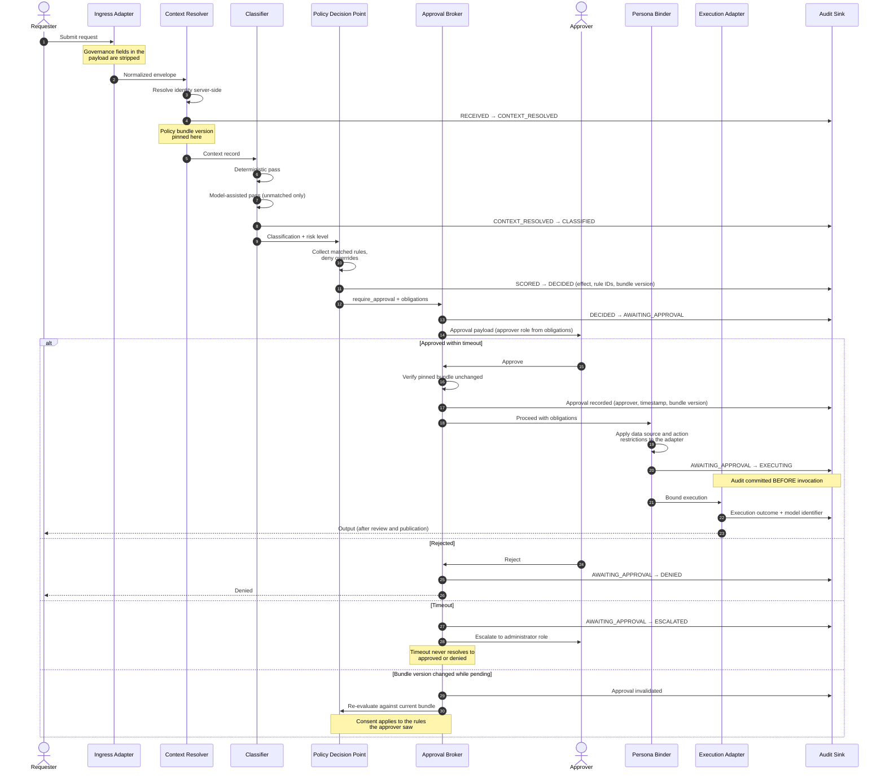

# Approval Sequence

The end-to-end sequence for a request that requires human approval, showing where audit records are written and where the decision is enforced.

The critical ordering property is that the audit record precedes execution, and that the approval is bound to the policy bundle version the approver saw.

## Enforcement points

| Step | Enforcement |
|------|-------------|
| Ingress | Caller-supplied classification, risk, and routing fields are rejected |
| Context resolution | Identity is resolved server-side; the bundle version is pinned |
| Decision | The single point where the governance outcome is determined |
| Approval | Bound to a decision and a bundle version; invalidated if either changes |
| Binder | Data source and action restrictions applied to the adapter, not the prompt |
| Audit | Written before invocation; an unavailable sink blocks execution |

Related: [`../DESIGN.md`](../DESIGN.md) §4 (lifecycle), §5 (policy evaluation), §9 (trust boundaries).
