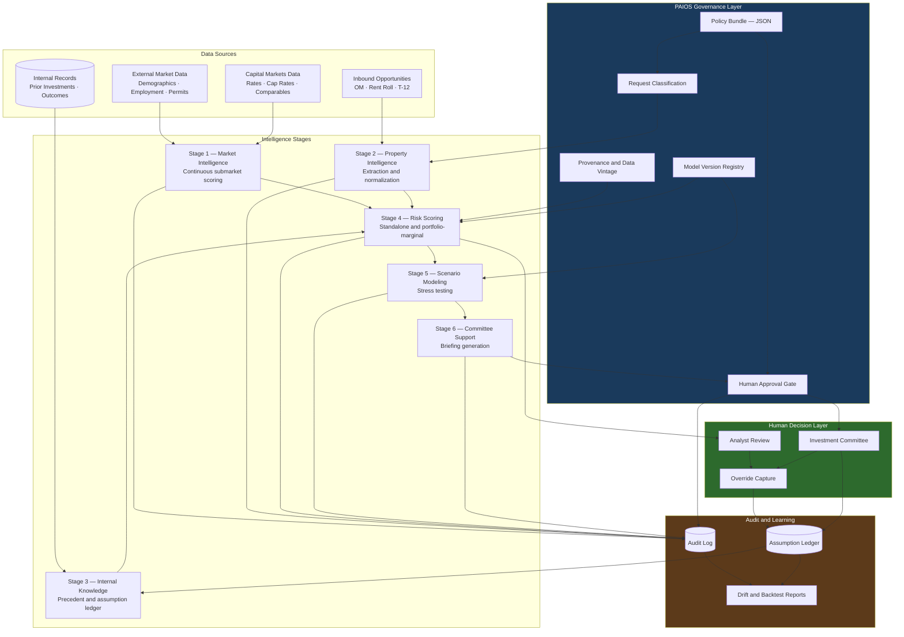

# Deal Intelligence Architecture

The Deal Intelligence Pipeline applied to a private real estate investment context, showing data sources, the six intelligence stages, governance controls, and the human decision layer.

The design constraint reflected throughout: analysis flows toward people, and decision authority never flows back into the system.

## Architectural Notes

**Analysis flows one direction.** Intelligence stages produce output that moves toward the human decision layer. No path returns from the decision layer into an execution action. The system prepares; it does not act.

**The learning loop is closed through people.** Outcomes and overrides are captured from analyst and committee activity, written to the assumption ledger, and fed back into Stage 3. The system learns from recorded human judgment rather than from its own prior output.

**Governance is applied to inputs, not appended to outputs.** Classification, provenance, and model version registration constrain the intelligence stages as they run. Governance applied only at the end would produce results that cannot be traced.

**Every stage writes to the audit log.** Reproducing any analysis requires the model version and data vintage in effect when it was produced, both of which are recorded at execution time.

## Related Documentation

- [Deal Intelligence Pipeline](../../docs/DEAL_INTELLIGENCE_PIPELINE.md)
- [Deal Scoring and Model Governance](../../docs/DEAL_SCORING_AND_MODEL_GOVERNANCE.md)
- [Deal Screening Funnel](../workflows/deal-screening-funnel.md)
- [System Architecture](system-architecture.md)
