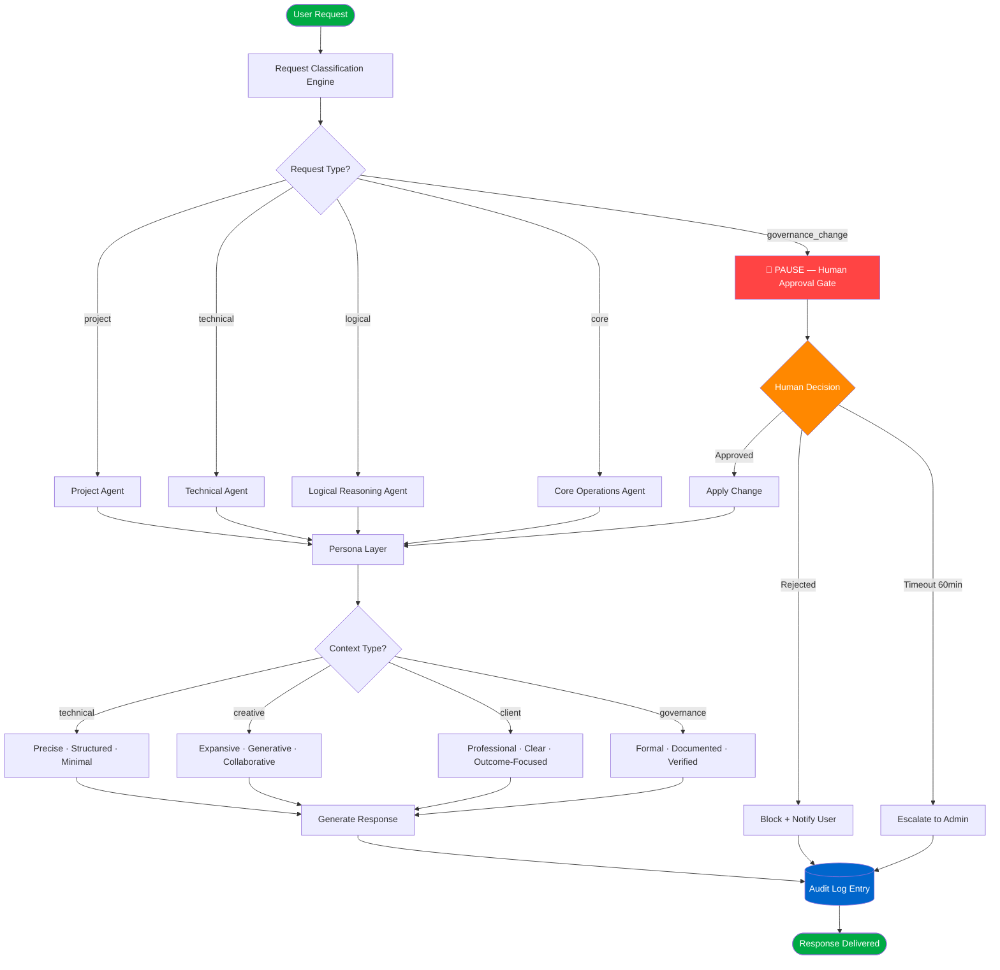

# Governance Workflow

Every request processed by the PAIOS control plane moves through this lifecycle.

```mermaid
flowchart TD
    A([User Request]) --> B[Request Classification Engine]

    B --> C{Request Type?}

    C -->|project| D[Project Agent]
    C -->|technical| E[Technical Agent]
    C -->|logical| F[Logical Reasoning Agent]
    C -->|core| G[Core Operations Agent]
    C -->|governance_change| H[🔴 PAUSE — Human Approval Gate]

    H --> I{Human Decision}
    I -->|Approved| J[Apply Change]
    I -->|Rejected| K[Block + Notify User]
    I -->|Timeout 60min| L[Escalate to Admin]

    D --> M[Persona Layer]
    E --> M
    F --> M
    G --> M
    J --> M

    M --> N{Context Type?}
    N -->|technical| O[Precise · Structured · Minimal]
    N -->|creative| P[Expansive · Generative · Collaborative]
    N -->|client| Q[Professional · Clear · Outcome-Focused]
    N -->|governance| R[Formal · Documented · Verified]

    O --> S[Generate Response]
    P --> S
    Q --> S
    R --> S

    S --> T[(Audit Log Entry)]
    K --> T
    L --> T

    T --> U([Response Delivered])

    style H fill:#ff4444,color:#fff
    style I fill:#ff8800,color:#fff
    style T fill:#0066cc,color:#fff
    style A fill:#00aa44,color:#fff
    style U fill:#00aa44,color:#fff
```
