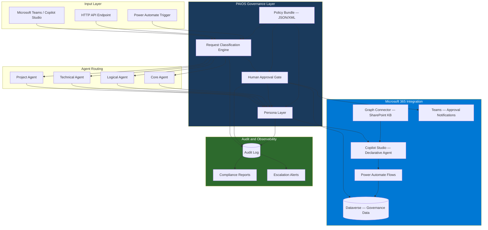

# System Architecture

The PAIOS system architecture showing the relationship between the input layer, governance controls, agent routing, Microsoft 365 integration, and audit systems.

```mermaid
graph TB
    subgraph INPUT["Input Layer"]
        UI[Microsoft Teams / Copilot Studio]
        API[HTTP API Endpoint]
        PA[Power Automate Trigger]
    end

    subgraph GOVERNANCE["PAIOS Governance Layer"]
        CLASS[Request Classification Engine]
        GATE[Human Approval Gate]
        PERSONA[Persona Layer]
        POLICY[Policy Bundle — JSON/XML]
    end

    subgraph AGENTS["Agent Routing"]
        PA2[Project Agent]
        TA[Technical Agent]
        LA[Logical Agent]
        CA[Core Agent]
    end

    subgraph M365["Microsoft 365 Integration"]
        COPILOT[Copilot Studio — Declarative Agent]
        AUTOMATE[Power Automate Flows]
        DATAVERSE[(Dataverse — Governance Data)]
        GRAPH[Graph Connector — SharePoint KB]
        TEAMS_N[Teams — Approval Notifications]
    end

    subgraph AUDIT["Audit and Observability"]
        LOG[(Audit Log)]
        REPORT[Compliance Reports]
        ALERT[Escalation Alerts]
    end

    UI --> CLASS
    API --> CLASS
    PA --> CLASS

    CLASS --> GATE
    CLASS --> PA2
    CLASS --> TA
    CLASS --> LA
    CLASS --> CA

    GATE --> TEAMS_N
    GATE --> DATAVERSE

    PA2 --> PERSONA
    TA --> PERSONA
    LA --> PERSONA
    CA --> PERSONA
    GATE --> PERSONA

    POLICY --> CLASS
    POLICY --> GATE
    POLICY --> PERSONA

    PERSONA --> COPILOT
    COPILOT --> AUTOMATE
    AUTOMATE --> DATAVERSE
    GRAPH --> COPILOT

    CLASS --> LOG
    GATE --> LOG
    PERSONA --> LOG
    LOG --> REPORT
    LOG --> ALERT

    style GOVERNANCE fill:#1a3a5c,color:#fff
    style M365 fill:#0078d4,color:#fff
    style AUDIT fill:#2d6a2d,color:#fff
```
