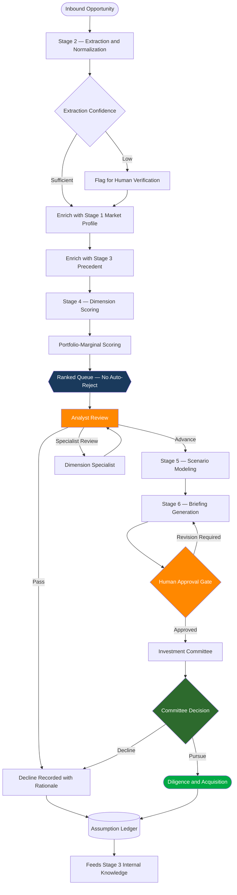

# Deal Screening Funnel

This workflow describes how an opportunity moves from inbound receipt to investment committee decision under the [Deal Intelligence Pipeline](../../docs/DEAL_INTELLIGENCE_PIPELINE.md), and where human authority is applied.

The defining characteristic of the funnel is that every exit from the pipeline is a human decision. The system narrows attention; it does not narrow the pipeline.

## Screening Flow

## Stage Gates

| Gate | Owner | Authority |
|------|-------|-----------|
| Extraction verification | Analyst | Confirms or corrects extracted values |
| Ranked queue | System | Orders attention only; cannot remove an opportunity |
| Analyst review | Analyst | Sole authority to decline at screening |
| Specialist review | Dimension specialist | Advisory input on a flagged dimension |
| Briefing approval | Named reviewer | Required before committee distribution |
| Committee decision | Investment committee | Capital allocation authority |

## Decline Handling

Declines are recorded rather than discarded.

Each decline captures the rationale, the dimension scores at the time of review, and the reviewer. This produces the counterfactual record that screening processes normally lack — a set of opportunities the firm chose not to pursue, with the reasoning attached.

That record supports three things:

- Review of whether screening criteria are applied consistently
- Detection of systematic bias against a market, asset type, or partner
- Periodic review of low-ranked opportunities to test whether ranking is suppressing viable deals

Without a decline record, the false negative rate is unobservable, and the screening layer cannot be evaluated at all.

## Volume and Attention

The funnel is designed around a narrow acquisition rate relative to review volume.

| Point in funnel | Purpose | System contribution |
|-----------------|---------|--------------------|
| Inbound | Receive and normalize all opportunities | Extraction; every opportunity is structured, none are skipped for lack of time |
| Ranked queue | Prioritize analyst attention | Ordering and flagging; no filtering |
| Analyst review | Apply judgment at volume | Consistent evidence base per opportunity |
| Scenario modeling | Test surviving opportunities | Breadth of scenarios beyond manual capacity |
| Committee | Decide | Prepared, traceable, comparable material |

The objective is not to reduce the number of opportunities reaching an analyst. It is to ensure that every opportunity arriving is structured and evaluated rather than triaged by whatever capacity happened to be available that week.

## Escalation Paths

| Condition | Escalation |
|-----------|-----------|
| Extraction confidence below threshold | Human verification before scoring |
| Single dimension at the low end of its range | Specialist review rather than aggregate downgrade |
| Opportunity outside documented model scope | Governance exception and approval required |
| Portfolio-marginal score indicates concentration breach | Portfolio management review |
| Override diverging from model output | Logged with rationale for quarterly review |

## Related Documentation

- [Deal Intelligence Pipeline](../../docs/DEAL_INTELLIGENCE_PIPELINE.md)
- [Deal Scoring and Model Governance](../../docs/DEAL_SCORING_AND_MODEL_GOVERNANCE.md)
- [Deal Intelligence Architecture](../diagrams/deal-intelligence-architecture.md)
- [Request Classification Flow](request-classification-flow.md)
