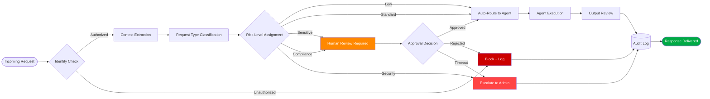

# Request Classification Flow

The request classification flow describes how incoming requests are evaluated, categorized, and routed through the PAIOS governance model.

## Classification Steps

## Classification Categories

| Request Type | Description | Default Routing |
|-------------|-------------|-----------------|
| `project` | Project planning, tracking, coordination | Project Agent |
| `technical` | Technical support, troubleshooting, implementation | Technical Agent |
| `logical` | Analysis, reasoning, research | Logical Agent |
| `core` | General operations, documentation, communication | Core Agent |
| `governance_change` | Any modification to governance rules or policy | Human Approval Gate |

## Risk Levels

| Level | Trigger Condition | Action |
|-------|------------------|--------|
| Low | Routine request, no sensitive data | Auto-execute |
| Standard | Normal operational request | Auto-execute with logging |
| Sensitive | Personal data, client information involved | Human review |
| Compliance | Regulatory or legal implications | Human review + documentation |
| Security | System changes, access modifications | Admin escalation |
