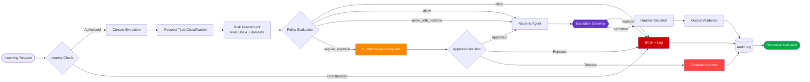

# Request Classification Flow

The request classification flow describes how incoming requests are evaluated, categorized, and routed through the PAIOS governance model.

## Classification Steps



> **Migration note.** Previous PAIOS revisions represented Low, Standard,
> Sensitive, Compliance, and Security within a single taxonomy. PAIOS now
> separates impact severity (L0–L4) from non-exclusive risk domains.

## Classification Categories

| Request Type | Description | Default Routing |
|-------------|-------------|-----------------|
| `project` | Project planning, tracking, coordination | Project Agent |
| `technical` | Technical support, troubleshooting, implementation | Technical Agent |
| `logical` | Analysis, reasoning, research | Logical Agent |
| `core` | General operations, documentation, communication | Core Agent |
| `governance_change` | Any modification to governance rules or policy | Human Approval Gate |

## Risk — Two Axes

Risk is assessed on two independent axes. A request carries exactly one level
and any number of domains, serialized as:

```json
{ "risk_level": "L3", "risk_domains": ["security", "compliance"] }
```

### Axis 1 — `risk_level` (impact severity, ordered)

Answers *how much damage could this do*.

| Level | Meaning | Default disposition |
|-------|---------|--------------------|
| `L0` | Informational / read-only / public | Auto-execute |
| `L1` | Low-impact internal | Auto-execute with logging |
| `L2` | Controlled business action | Auto-execute with logging |
| `L3` | Sensitive / high-impact | Human review |
| `L4` | Prohibited, or executive / security escalation | Admin escalation |

### Axis 2 — `risk_domains` (kind of concern, non-exclusive)

Answers *what kind of concern is this*. Zero or more per request.

| Domain | Covers |
|--------|--------|
| `security` | Access, credentials, privilege, destructive operations |
| `compliance` | Regulatory, legal, contractual, retention |
| `privacy` | Personal data, PII, client and employee records |
| `financial` | Compensation, payroll, contractual value |
| `operational` | Routine business mutation |
| `governance` | Changes to the governance rules themselves |

The two axes are independent by design. A compliance question and a security
change differ in *kind*, not magnitude, and one request can raise both — which
a single ordered taxonomy could not express.

Assignment ratchets: detectors escalate the level and accumulate domains, and
nothing lowers a level once raised. Detectors are configuration, in
`policies/risk-model.json`.

**Risk never authorizes execution.** A low level is not permission. Risk is one
input to the policy decision alongside identity, environment, and the tool
contract; execution is authorized only by the Execution Gateway.

## Policy Decision

Policy evaluation returns one decision, resolved across every matching policy
by precedence:

```
deny  >  require_approval  >  allow_with_controls  >  allow
```

Any applicable `deny` wins, and approval can never override it.

## Authorization vs Policy

Two separate layers, answering different questions:

| Layer | Question | Runs |
|-------|----------|------|
| **Authorization** | Is this identity entitled to attempt this class of operation? | Before classification |
| **Policy** | May this specific, otherwise-authorized request proceed under current governance conditions? | After risk assessment |

An authenticated, properly authorized administrator can still submit a request
that policy must refuse.
