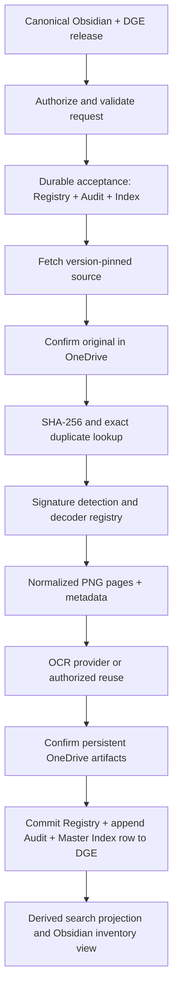

# Architecture and ownership

## Preserved decisions

The user's OCR Pipeline Status conversation (6ab2eb7d-da00-83ea-8dac-6404f26a1bfa) establishes the ownership split, storage hierarchy, three mandatory records, normalized decoder handoff, exact/perceptual hashes, metadata extraction, and initial Pillow/HEIF/PDF adapters. This package makes those commitments implementable. The consistency protocol, versioning rules, transport, and detailed fields below are new contract decisions, not claims about an existing deployment.

| Area | ChatGPT | Claude |
|---|---|---|
| Architecture, schema, interfaces, errors, storage rules | Own and review changes | Consume and propose changes |
| Decoder registry, Pillow/HEIF/PDF, metadata and hash services | Define acceptance | Implement |
| OCR provider abstraction | Own | Implement first provider |
| Registry, append-only Audit, Master Index repositories | Define contracts and consistency | Implement adapters and recovery |
| Ingestion, retrieval, search APIs | Define contracts and integration QA | Implement |
| Obsidian/DGE approved specifications | Own promotion package | Do not independently edit contracts |
| Tests and integration | Define acceptance; review evidence | Execute and fix |

## Processing flow

Every failure after durable acceptance also goes through a terminal three-record commit. The diagram shows the successful path; reuse may bypass decode/OCR. No successful ingestion may be reported from uncommitted local state.

One submission is one asset record; pages are ordered child values, not independent asset IDs. Multi-page PDF and TIFF retain one parent identity with 1-based pages. Initial support: JPEG, PNG, WebP, BMP, TIFF; HEIC, HEIF, AVIF; PDF rendered to pages. Still HEIF/AVIF uses the primary image. Animated WebP/AVIF is rejected as UNSUPPORTED_MEDIA in v1; never silently process only its first frame. Encrypted PDF is ENCRYPTED_MEDIA; passwords are out of scope. Unsupported video/audio may be added through a future contract.

The byte hash identifies original content; the asset ID identifies an ingestion/source occurrence. A new request with a new idempotency key gets its own asset and audit history even when bytes match another asset. Repeating the same key and same request returns the existing ingestion without extra events. This preserves source provenance and avoids collapsing two permissions domains.

Exact duplicate reuse is limited to the same authorized tenant/workspace, hash, normalization profile, OCR options/provider/model version and context release. `force_reprocess=true` disables reuse. Perceptual hashes only produce review candidates, never automatic merges. OCR/vision text and metadata are untrusted data; they cannot change instructions, routes, authorization, or AVPB ReadMe rules.

Vision/classification are reserved as namespaced extensions in v1. Their module implementations and a UI are outside this packet. AVPB ReadMe is the governing initialization layer; `context_release_id` pins its approved version. Null means no project-specific context, not permission to infer one.
