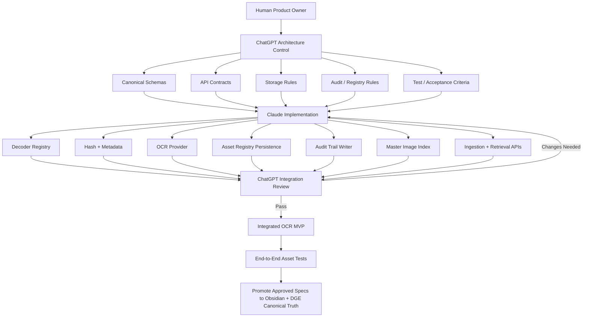

# Image Ingestion Build Plan

Work plan for the image ingestion and OCR pipeline. It replaces the earlier two-track build plan. This version adds the storage-of-truth and audit requirements: the Asset Registry, the append-only Audit Log, the Master Image Index, and the storage tiers.

> This file is a working copy of the plan. It is not the canonical specification. Approved specifications are promoted to Obsidian and the DGE, and those copies are the source of truth. The implementation does not modify them directly.

## Operating Rule

- **ChatGPT** owns architecture, contracts, governance, integration and QA.
- **Claude** is the implementation workforce.
- Claude does not redesign shared interfaces on its own. If an implementation needs a contract change, Claude proposes the change and waits for approval before building against it.
- Every packet is reviewed against the architecture before it is accepted.

## Division of Responsibility

| Workstream | ChatGPT | Claude |
|---|---|---|
| Architecture control | Own | Implement to contract |
| Canonical schemas | Own | Consume |
| API/interface contracts | Own | Implement |
| Decoder registry design | Own | Build |
| Pillow/HEIF/PDF decoders | Review | Build |
| Hashing + duplicate logic | Define acceptance | Build |
| Metadata schema | Own | Build extractor |
| OCR provider contract | Own | Build first provider |
| Asset Registry schema | Own | Build persistence |
| Audit Log schema | Own | Build append-only writer |
| Master Image Index schema | Own | Build indexing updates |
| `POST /images/ingest` | Review | Build |
| `GET /images/{id}` | Review | Build |
| Search foundation | Define contract | Build |
| Obsidian/DGE canonical docs | Own | Do not modify directly |
| OneDrive working assets | Define routing rules | Build connector/storage hooks |
| Local temp/cache behavior | Define rules | Implement |
| Testing/Definition of Done | Own | Execute/fix |
| Integration QA | Own | Fix against review |

## Workflow

## Storage of Truth

| Store | Role |
|---|---|
| Original file | Immutable. Never rewritten after ingestion. |
| OneDrive | Primary working asset storage. Routing rules are defined by ChatGPT. |
| Local disk | Temporary working files and cache only. Never the system of record. |
| Asset Registry | Current state of each asset. |
| Audit Log | Immutable, append-only history of every processing event. |
| Master Image Index | Searchable retrieval metadata. |
| Obsidian / DGE | Canonical architecture and specifications. Read-only to the implementation. |

## Packets

### Packet 1: Pre-OCR ingestion foundation

Implement:

- `MediaTypeDetector`
- `DecoderRegistry`
- Pillow decoder
- HEIC/HEIF/AVIF decoder
- PDF decoder
- Normalization
- SHA-256
- Perceptual hash
- Metadata extraction

Rules:

- Originals are immutable.
- Local storage is temporary working/cache only.
- OneDrive is primary working asset storage.
- Canonical architecture/specifications are not modified by this implementation.
- Every asset receives an `asset_id`.
- Every processing stage exposes structured status and errors.
- No OCR, database, audit or final routing logic in this packet.
- Includes unit tests.

### Packet 2: Persistence

Implement:

- Asset Registry
- Append-only Audit Log
- Master Image Index
- Duplicate lookup by SHA-256
- Registry update methods
- Audit event writer
- Index update methods

Requirements:

- Registry = current asset state.
- Audit = immutable history.
- Index = searchable retrieval metadata.
- Ingestion is not successful unless all required records are written.
- Use transactions where appropriate.
- Includes tests.

### Packet 3: OCR integration

Implement:

- `OCRProvider` interface
- First OCR provider
- Text extraction
- Confidence
- Language
- Region/bounding-box-ready schema
- Structured OCR errors
- Registry update
- Audit events: `ocr_completed` / `ocr_failed`
- Index update with OCR text

Out of scope: vision and scene classification.

### Packet 4: API orchestration

`POST /images/ingest` runs, in order:

1. Detect
2. Decode
3. Normalize
4. Hash
5. Duplicate check
6. Metadata
7. Registry create
8. Audit write
9. Index update
10. OCR
11. Registry update
12. Audit write
13. Index update
14. Return asset

`GET /images/{asset_id}` returns the stored asset record.

Route handlers stay thin. All processing lives in services.

## Acceptance Gate

The gate is four real files: **JPEG**, **PNG**, **HEIC** and **PDF**.

Each file must produce:

- A stored asset
- A registry entry
- Audit history
- A master index entry
- An OCR result
- A retrievable API record

## Contract Package and Status

ChatGPT issued the contract package at [`contracts/image-ingestion`](../contracts/image-ingestion) (release 1.0.0). Claude builds against it and does not edit it.

| Packet | Contract inputs | Status |
|---|---|---|
| 1 | [Packet 1 issued contract](../contracts/image-ingestion/handoff/PACKET-1-ISSUED-CONTRACT.md): `Metadata`, `Error` and `NormalizedMedia` schemas, `interfaces/contracts.py` | Implemented in [`apps/image-ingestion`](../apps/image-ingestion). Submitted for review in [PACKET-1-RETURN.md](../apps/image-ingestion/PACKET-1-RETURN.md). |
| 2 | `RegistryEntry`, `AuditEvent`, `MasterIndexEntry` and `CommitBundle` schemas; `docs/storage-and-consistency.md`; `docs/persistence-model.md` | Not started. Needs a coordinator/database technology proposal first. |
| 3 | `OCRResult`, `OCRPage` and `OCRBlock` schemas; the `OCRProvider` protocol | Not started. Needs a provider profile proposal first. |
| 4 | `api/openapi.json`, `docs/api-behavior.md`, [acceptance matrix](../contracts/image-ingestion/acceptance/acceptance.md) | Not started |

The contract package supersedes two parts of this plan:

- **Record writes.** The separate Registry, Audit and Index writes listed in Packet 4 are replaced by one logical, atomic `CommitBundle` publication, which is accepted durably before any processing starts.
- **OCR events.** `ocr_completed` and `ocr_failed` map to the terminal `ingestion_completed`, `ingestion_partial` and `ingestion_failed` events.

See [PLAN-RECONCILIATION.md](../contracts/image-ingestion/handoff/PLAN-RECONCILIATION.md).
